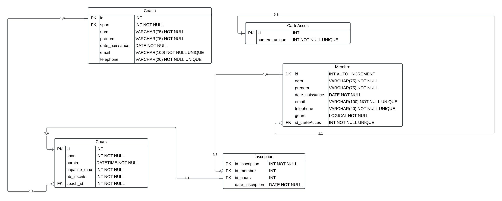

# La Poigne d'Acier - Système de Gestion

## 📋 À propos du projet

Ce projet consiste en un système de gestion pour la salle de sport "La Poigne d'Acier", un établissement de fitness situé au cœur de la ville. Le système permet de gérer les adhérents, les cours, les instructeurs et les réservations.

## 🎯 Contexte

La Poigne d'Acier est un lieu emblématique pour les passionnés de fitness, de musculation et de boxe. L'établissement propose une large gamme de cours adaptés à tous les niveaux, des débutants aux athlètes confirmés.

## 📊 Modèle de données

## 🏋️‍♂️ Services proposés

### Types de cours
- Musculation
- Fitness
- Boxe
- Cross-training
- Cardio

### Niveaux disponibles
- Débutant
- Intermédiaire 
- Avancé

## ⚙️ Fonctionnalités principales

- [x] Gestion des adhérents
- [x] Planification des cours
- [x] Réservation de séances
- [x] Suivi des présences
- [x] Gestion des abonnements

## 📝 Notes techniques

### Prérequis
- installer les pré-requis  : 
    `pip install -r requirements.txt`
- Base de données relationnelle
- Interface utilisateur intuitive
- Système de réservation en temps réel

👥 Équipe

  - Malek
  - Sami

---

***Note**: Ce README est en cours de développement et sera mis à jour régulièrement avec de nouvelles informations.*